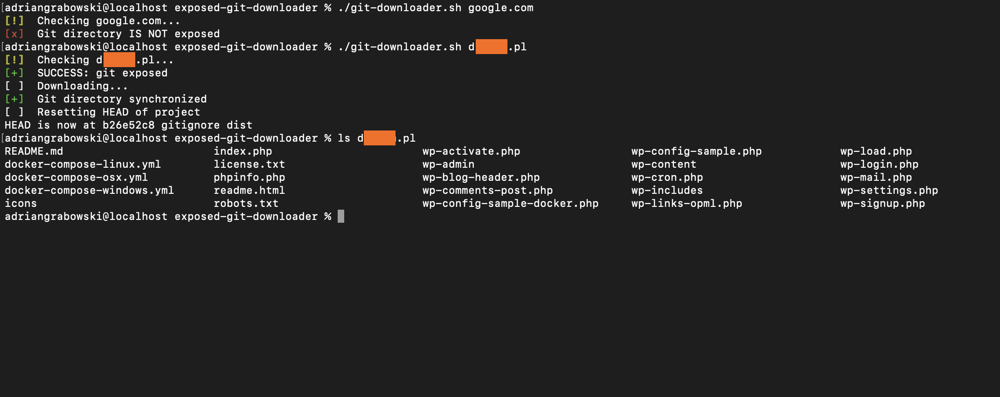

# Exposed Git Downloader

Restore GIT repository by publicly exposed .git directory

Most of the web-applications are maintained using git repositories
containing important data like db-info, logs, configs, main-source code,
etc. Many of them are forget to hide or remove the .git directory from
live websites. Its can able to expose of important data.

### 📋 Requirements
* wget
* git

Linux:

`sudo apt-get install wget`

`sudo apt-get install git`

MacOS:

`brew install wget`

`brew install git`

### 📋 Google Dorks
* intitle:"Index of /.git"

### 📋 Legal disclaimer

Usage of **Exposed Git Downloader** for attacking targets without prior mutual consent is illegal. It is the end user's responsibility to obey all applicable local, state and federal laws. Developers assume no liability and are not responsible for any misuse or damage caused by this program

### 🚀 How to use

`chmod +x git-downloader.sh`

`./git-downloader.sh target-url.com`

### Screenshot

